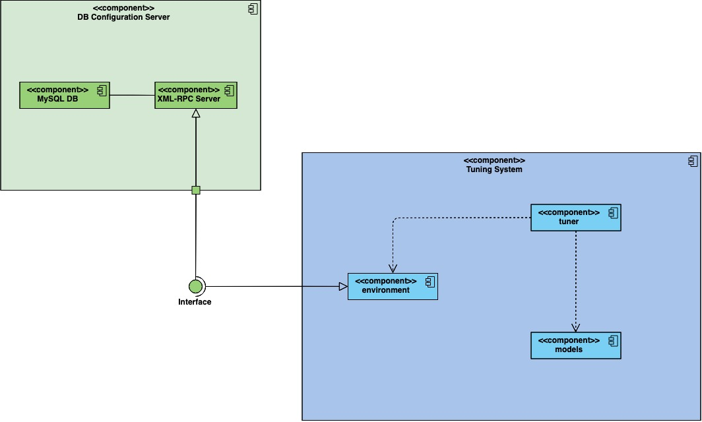

# CDBTune文档大纲

## 整体架构

**CDBTune **的主要部分 **AutoTune** 分为两个部分：调节参数的 **RL Tuner** 程序和控制 MySQL 数据库的 **Configure Server**

**RL Tuner** 按照强化学习一般规范将 task 分为三个模块--`environment`（环境）, `models`（强化学习算法）和`tuner`（学习主循环）

`environment`是关于环境部分实现的模块，涉及到如何将`models`的 action 输出转换为数据库配置参数、如何与控制 MySQL 数据库的 **Configure Server** 通信、如何应用配置参数到待调优数据库等。`models`是关于强化学习算法的模块，涉及到到使用的强化学习算法具体实现的细节，例如 DDPG、DQN。`tuner`是 **RL Tuner** 运行的部分，通过循环来完成 agent 的学习与训练

**CDBTune** 中 **AutoTune** 的架构



## 如何运行（简略版）

Docker中root密码为123456，loong密码为123456

0. `docker start AutoTuner`开启docker容器

1. `ssh`登陆yilong的用户，并运行`docker exec -it AutoTuner bash`命令打开Docker
2. `cd ~/CDBTune/AutoTuner/tuner/`进入代码主目录，`service mysql stop`关闭数据库和其他后台应用
3. `su loong`登陆普通用户loong，运行`bash ../server/start_server.sh`打开MySQL Configuration服务器
4. `exit`退回root用户（可选：参照[几个重要的 CDBTune 参数](#几个重要的 CDBTune 参数)小节修改CBDTune参数）
5. 运行`python train.py --instance mysql1`（train.py的更多参数参看[几个重要的 CDBTune 参数](#几个重要的 CDBTune 参数)小节）开始训练
6. （可选）运行`python get_proposal_knob --knobfile ./knob_metric/knob_metric.txt` 得到推荐配置

## 训练过程

运行 `python train.py --instance mysql1`后，`tuner/train.py`文件开始进行主学习循环。

整个训练过程：

1. 创建控制数据库的 Environment 类的实例
2. 创建特定强化学习算法的类的实例
3. 开始训练循环，循环次数由设定的Epoch数决定
   1. 开始每次Epoch的循环
      1. 采样
      2. 如果数据量不足一个batch_size，break并重复采样
      3. 如果训练结果太差`score < -50`或者根据用户设定的条件（通过`done`的变量控制），则进行下一个Epoch


## 训练结果

下图展示训练过程中的前三个epoches的训练过程。**每个数据点**代表一次调优step中，使用调整过的参数部署MySQL，并 **sysbench** 测试得到的性能数据和积累的Score

除了有关log文件大小的knobs参数被修改外，大多数参数为源代码中默认值。而且特别的，`reward = 0.4 * tps_reward + 0.6 * lat_reward`。

由图可知，不同epoch之间的调优路径大为不同:

1. 在**Epoch 1**中，*performance* 和 *score* 随着step的增加，缓慢下降。


2. 在**Epoch 2**中，*performance* 和 *score* 随着step的增加，大体上不变。


3. 在**Epoch 3**中，*performance* 和 *score* 随着step的增加，缓慢上升。


**问题**：为什么同样的初始knobs值，**Epoch 1**初始性能比之后两次的**Epoches**的性能要好一些？

## 文件文档

### 整体结构

整个代码目录如下

```bash
|-- Dockerfile # Docker配置文件管理代码的虚拟环境
|-- debug # debug文档
|-- doc	# 文档
|-- environment # RL环境模块
|   |-- __init__.py
|   |-- base.py # Logger和Error等功能
|   |-- configs.py # MySQL数据库的配置文件
|   |-- default.txt
|   |-- knobs.py # Knobs设置和有关Knobs的函数
|   |-- mysql.py # MySQL类
|   |-- utils.py # MySQL Env Utils
|-- models （RL算法模块）
|   |-- OUProcess.py # OU过程噪声
|   |-- __init__.py
|   |-- ddpg.py
|   |-- ddpg_test.py 
|   |-- dqn.py
|   |-- prioritized_replay_memory.py # prioritized replay memory
|   |-- replay_memory.py # replay memory
|-- requirements.txt # 代码依赖软件版本
|-- scripts # 数据库压测脚本
|   |-- prepare.sh
|   |-- run_sysbench.sh # 默认运行sysbench
|   |-- run_sysbench.test.sh
|   |-- run_tpcc.sh
|   |-- tpcc_load.sh
|-- server # Configure Server的运行脚本
|   |-- log
|   |-- server.log
|   |-- server.py
|	|-- start_server.sh # 后台开启Configure Server的脚本
|-- train_result # 每次数据库压测的结果
|   |-- tmp
|   |-- tmp1564709915.txt
|   |-- tmp1564710093.txt
|-- tuner # CDBTune训练的部分
    |-- __init__.py
    |-- collect_fine_sas.py # 训练完成后收集 Fine State-Action pairs
    |-- evaluate.py # 评估Model
    |-- get_proposal_knob.py # 当训练完成后，从Knob file提取推荐的knob应用到MySQL
    |-- log # 训练中每step保存的详细信息（包括performance，reward和score）
    |   |-- train_ddpg_1564539488.log
    |-- memory_utils.py # memory pool保存与读取的功能
    |-- model_params # 训练算法的神经网络参数
    |   |-- train_ddpg_1564539488_990_actor.pth
    |   |-- train_ddpg_1564539488_990_critic.pth
    |   |-- train_ddpg_1564539488_995_actor.pth
    |   |-- train_ddpg_1564539488_995_critic.pth
    |-- save_knobs # 每step的performance和调节的knobs值
    |   |-- knob_metric.txt
    |-- save_memory # RL算法的memory pool，每10 steps存储一次
    |   |-- train_ddpg_1564539488.pkl
    |-- save_state_actions # 储存的state和actions，每10 steps存储一次
    |   |-- train_ddpg_1564539488.pkl
    |-- supervised_train.py # 如果有数据时CDBTune的训练
    |-- train.py # CDBTune的训练主循环
    |-- utils.py # 保存训练过程参数的Logger的功能
```

### 主要文件

#### tuner文件夹

##### train.py

CDBTune 的训练主循环，可以通过`--选项 选项值`调整训练参数

具体参数参见[几个重要的 CDBTune 参数](#几个重要的 CDBTune 参数)

##### get_proposal_knob.py

从knob_file中得到推荐的knobs，需要注释掉有关`tuner_configs`的语句

#### models文件夹

##### ddpg.py

Deep Deterministic Policy Gradient Model算法

##### dqn.py

Deep Q Network算法

##### OUProcess.py

OU随机过程为DDPG添加随机性

#### environment文件夹

##### mysql.py

###### class MySQLEnv(object)

描述MySQL环境的基类

###### class Server(MySQLEnv)

描述一般服务器的MySQL环境的类

###### class TencentServer(MySQLEnv)

描述腾讯云服务器的MySQL环境的类

##### knobs.py

包含有关knobs的设置和函数，其中`init_knobs`和`get_init_knobs`设置knobs初始值，`gen_continuous`将**RL**算法的输出转变为MySQL配置的值，`save_knobs`将knobs保存为文件

##### utils.py

MySQL Env Utils，其中`modify_configurations`负责与**Configure Server**通信，将参数应用到数据库

#### server文件夹

##### server.py

控制MySQL的 XML-RPC **Configure Server**

##### start_server.sh

开启**Configure Server**

## 从零开始的复现过程

1. MySQL必须是5.6版本（因此需要修改`dockerfile`）
2. 修改`my.cnf`文件为一下内容（因为代码调用了`[mysqld]`section）

```cnf
[mysqladmin]
[mysql]
[mysqld]
```

3. 打开 **Configure Server**的 MySQL `service mysql start`
4. 创建`sbtest`数据库
5. 在 **RL Tuner** 服务器准备 sysbench -- 运行 `bash prepare.sh $1 $2 $3 $4 $5`，其中

```bash
$1	# 'read'	运行oltp_read_only.lua
	# 'write' 	运行oltp_write_only.lua
    # else 		运行oltp_read_write.lua
$2	# 待调优服务器ip
$3	# 待调优服务器数据库port
$4	# 待调优数据库root密码
$5	# limit for total execution time in seconds
```

例如，

```bash
sysbench '/usr/local/share/sysbench/oltp_read_only.lua' \
        --mysql-host='127.0.0.1' \
        --mysql-port=3306 \
        --mysql-user=root \
        --mysql-password='' \
        --mysql-db=sbtest \
        --db-driver=mysql \
        --tables=8 \
        --table-size=1000000 \
        --report-interval=10 \
        --threads=3 \
        --time=150 \
        prepare
```

5. 关闭 **Configure Server **的 MySQL`service mysql stop`
6. 在 **Configure Server** 用<u>普通用户</u>运行`bash server/start_server.sh`，并将<u>root用户</u>的密码改为123456或者修改`server/server.py`中相应参数
7. 在 **RL Tuner** 运行`python train.py --instance mysql1`，更多相关参数在`train.py`中


## 几个重要的 CDBTune 参数

这些参数与 CDBTune 模拟的质量严重相关！

### Reward 的参数

>We use $r$ to denote the sum of rewards of throughput and latency: 
>$$
>r = C_T*r_T+C_L*r_L
>$$
>

论文中通过上述公式(7)描述了 **CDBTune** 的 reward，而相应的代码在 `environment\mysql.py`文件中的`MySQLEnv`类的`_get_reward()`函数中，默认设置为 $C_T=0.4$ 和 $C_L=0.6$

```python
reward = tps_reward * 0.4 + 0.6 * lat_reward
```

### Knob 的参数的初始值与范围

`knobs.py`文件中存储了待调节的 63 个`knobs`的范围和初始设置，参数格式为`knobs_name:[value_type, value_range] `。

对于 `integer` 类型的 `KNOB`，`value_range`的格式为`[min, max, initial value]`；而`enum`类型的格式为`[value1, value2, ...]`，初始值取默认值

**实际调参的个数**不仅与`knob.py`中的设置有关，还需要在`train.py`中的`--default-knobs`参数和`—other_knob`参数的设置

在`knobs.py`相关代码类似如下：

```python
    KNOB_DETAILS = {
        'skip_name_resolve': ['enum', ['ON', 'OFF']],
        'innodb_log_files_in_group': ['integer', [2, 8, 2]],
        'innodb_log_file_size': ['integer', [134217728, 5497558138, 50331648]],
        'max_binlog_size': ['integer', [4096, 1073741824, 1073741824]],
        'binlog_format': ['enum', ['ROW', 'MIXED']],
    }

    # TODO: ADD Knobs HERE! Format is the same as the KNOB_DETAILS
    UNKNOWN = 0
    EXTENDED_KNOBS = {
        'innodb_adaptive_flushing_lwm': ['integer', [0, 70, 10]],
        'innodb_adaptive_max_sleep_delay': ['integer', [0, 1000000, 150000]],
        'innodb_spin_wait_delay': ['integer', [0, 6000, 6]],
    }
```

### `train.py`中的选项

`train.py`中的参数如下：

```python
    parser = argparse.ArgumentParser()
    # 'store_true' means when have argument --tencent, return true; vice versa
    parser.add_argument('--tencent', action='store_true', help='Use Tencent Server')
    parser.add_argument('--params', type=str, default='', help='Load existing parameters')
    parser.add_argument('--workload', type=str, default='read', help='Workload type [`read`, `write`, `readwrite`]')
    parser.add_argument('--instance', type=str, default='mysql1', help='Choose MySQL Instance')
    parser.add_argument('--method', type=str, default='ddpg', help='Choose Algorithm to solve [`ddpg`,`dqn`]')
    parser.add_argument('--memory', type=str, default='', help='add replay memory')
    parser.add_argument('--noisy', action='store_true', help='use noisy linear layer')
    parser.add_argument('--other_knob', type=int, default=0, help='Number of other knobs')
    parser.add_argument('--batch_size', type=int, default=16, help='Training Batch Size')
    parser.add_argument('--epoches', type=int, default=100, help='Training Epoches')
    parser.add_argument('--benchmark', type=str, default='sysbench', help='[sysbench, tpcc]')
    parser.add_argument('--metric_num', type=int, default=63, help='metric nums')
    parser.add_argument('--default_knobs', type=int, default=16, help='default knobs')
    opt = parser.parse_args()
```

### RL算法中的参数

在`train.py`中，设置了关于强化学习中神经网络和噪声的（超）参数

```python
    ...
    if opt.method == 'ddpg':

        ddpg_opt = dict()
        ddpg_opt['tau'] = 0.002
        ddpg_opt['alr'] = 0.0005
        ddpg_opt['clr'] = 0.0001
        ddpg_opt['model'] = opt.params
        n_states = opt.metric_num
        gamma = 0.99
        memory_size = 100000
        num_actions = opt.default_knobs + opt.other_knob
        ddpg_opt['gamma'] = gamma
        ddpg_opt['batch_size'] = opt.batch_size
        ddpg_opt['memory_size'] = memory_size

        model = models.DDPG(
            n_states=n_states,
            n_actions=num_actions,
            opt=ddpg_opt,
            ouprocess=not opt.noisy
        )
	...
    # OUProcess
    origin_sigma = 0.20
    sigma = origin_sigma
    # decay rate
    sigma_decay_rate = 0.99
    step_counter = 0
    train_step = 0
    if opt.method == 'ddpg':
        accumulate_loss = [0, 0]
    else:
        accumulate_loss = 0
```


## CDBTune 源代码中的问题

**CDBTune** 的原始源代码中存在着若干问题，因此无法立刻部署运行。其中最重要的几点问题是：

- 代码依赖于软件包的特定版本，例如MySQL v5.6，pexpect，而 `Dockerfile` 文件和 `requirement.txt` 文件中均没有明确地列出
  - 解决方法：查看源代码，重新编写相应 `Dockerfile`文件 和 `requirement.txt` 文件
- 强化学习的`environment`模块中需要有配置数据库的文件`configs.py`，而相应的部分在源代码中为空白，
  - 解决方法：根据调用的部分，编写相应的代码
- `environment/mysql.py`中调用了`db.py`文件的MySQLEnv类有问题，此外缺少描述普通服务器的Server类
  - 解决方法：通过`mysql.py.bak`补全相关的类Server，并修改相关的父类MySQLEnv绕过`db.py`文件
- `environment/knobs.py`中`init_knobs`函数等存在问题，无法合理地调用
  - 解决方法：根据调用的部分，修改相应代码
- 代码中缺少相关注释，并且不存在足够详细的文档
  - 解决方法：根据代码补全注释，并且编写相应文档


## 附录

### 1. sysbench 命令

sysbench 准备

```shell
sysbench '/usr/local/share/sysbench/oltp_read_only.lua' \
        --mysql-host='127.0.0.1' \
        --mysql-port=3306 \
        --mysql-user=root \
        --mysql-password='' \
        --mysql-db=sbtest \
        --db-driver=mysql \
        --tables=8 \
        --table-size=1000000 \
        --report-interval=10 \
        --threads=3 \
        --time=150 \
        prepare
```

sysbench 测试

```shell
sysbench '/usr/local/share/sysbench/oltp_read_only.lua' \
        --mysql-host='127.0.0.1' \
        --mysql-port=3306 \
        --mysql-user=root \
        --mysql-password='' \
        --mysql-db=sbtest \
        --db-driver=mysql \
        --tables=8 \
        --table-size=1000000 \
        --report-interval=10 \
        --threads=3 \
        --time=15 \
        run
```

